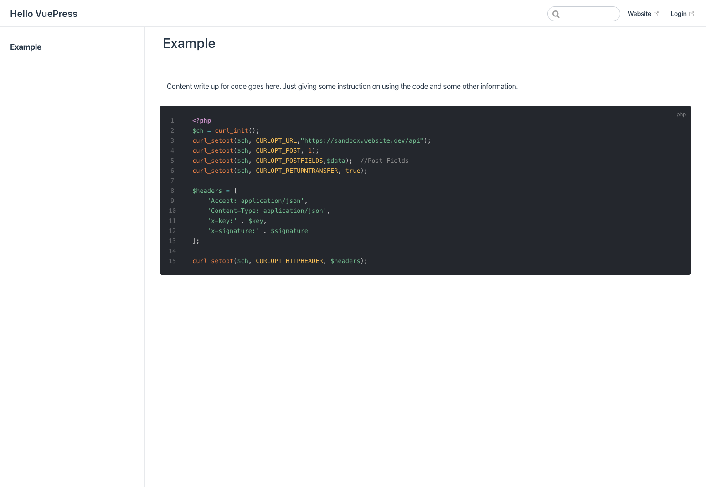

# Vuepress Two Column

This is a two column layout of Vuepress. It has the default theme imported and new components added for the two column layout.


## Installation

Make sure you have Vuepress installed. [Find instructions here.](https://vuepress.vuejs.org/guide/getting-started.html) 

Clone this repo and run `vuepress dev`.

```bash
$ git clone https://github.com/msbodetti/vuepress-two-column.git
$ cd vuepress-two-column
$ vuepress dev
```

## Usage

You can edit this README file with your content. Using the `<Block>` and `Example` tags, see below example:

```markdown
<Block>

# Code snippet

Content write up for code goes here. 

<Example>

Add snippet of code on this side in the markdown manner using three back-ticks ```

</Example>

</Block>
```

## Contributing
Pull requests are welcome. For major changes, please open an issue first to discuss what you would like to change.


<Block>

## Example

Content write up for code goes here. Just giving some instruction on using the code and some other information.

<Example>

```php
<?php
$ch = curl_init();
curl_setopt($ch, CURLOPT_URL,"https://sandbox.website.dev/api");
curl_setopt($ch, CURLOPT_POST, 1);
curl_setopt($ch, CURLOPT_POSTFIELDS,$data);  //Post Fields
curl_setopt($ch, CURLOPT_RETURNTRANSFER, true);

$headers = [
    'Accept: application/json', 
    'Content-Type: application/json', 
    'x-key:' . $key, 
    'x-signature:' . $signature
];

curl_setopt($ch, CURLOPT_HTTPHEADER, $headers);
```

</Example>

</Block>
